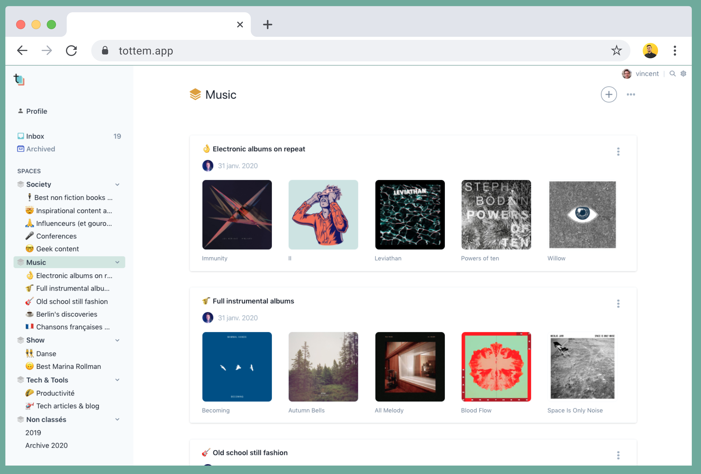
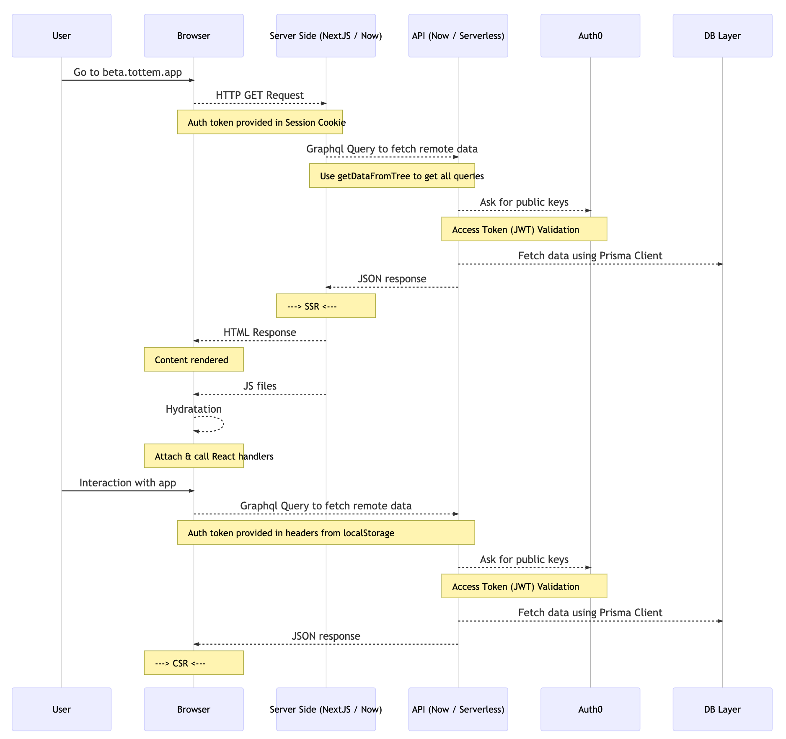
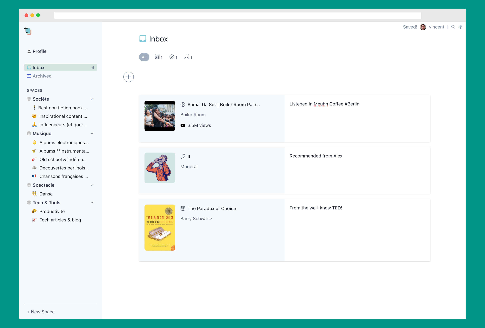
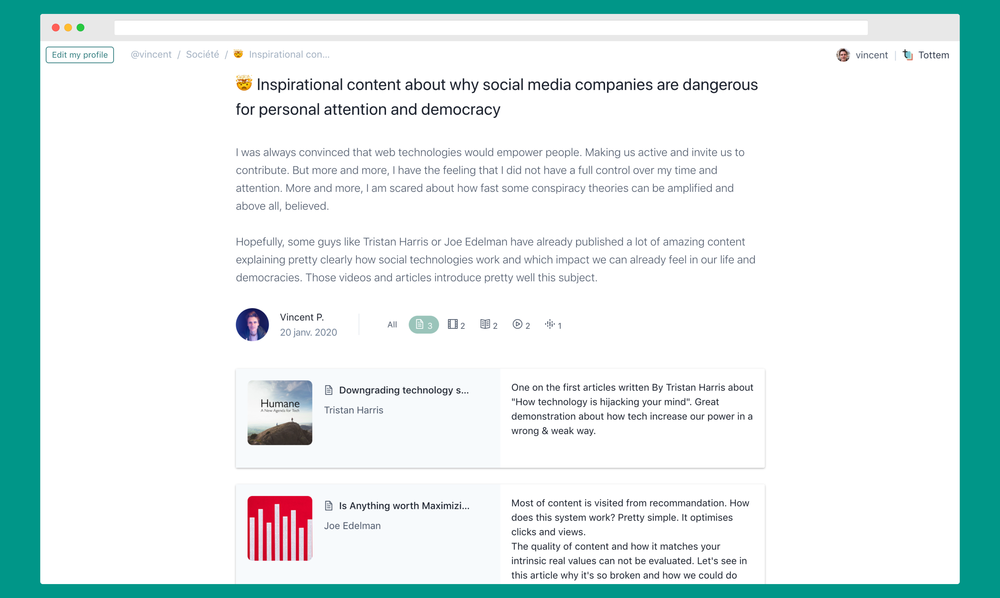
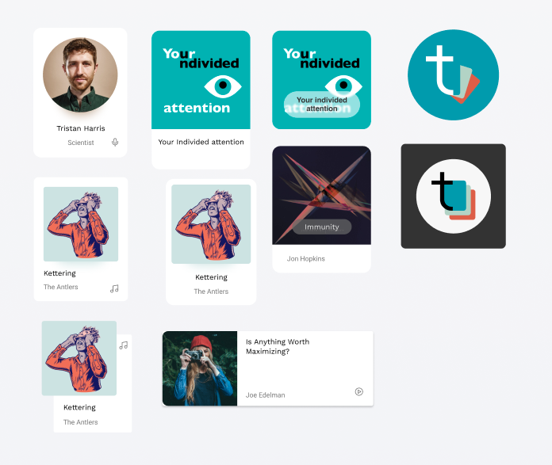

Tottem is an open source experimentation, it aims combining personal productivity tool approach with (slow) social media capabilities to make users empowered and somehow emancipated.

<div align="center">

[](https://beta.tottem.app)

### Library management made social

</div>

I have two considerations in mind:

-   building a product based on ethic design
-   experimenting open-source web technologies and share it

## Summary

-   [Summary](#summary)
-   [Tech](#tech)
    -   [Codebase](#codebase)
        -   [Main technologies](#main-technologies)
        -   [Repository structure — front-end](#repository-structure--front-end)
        -   [How is it typesafe from end-to-end?](#how-is-it-typesafe-from-end-to-end)
        -   [Global state management](#global-state-management)
    -   [SSR Workflow](#ssr-workflow)
    -   [Deployment](#deployment)
    -   [Setup](#setup)
-   [Product](#product)
    -   [Why ?](#why)
    -   [How ?](#how)
-   [Contributors](#contributors)

<div>

[](https://beta.tottem.app)

</div>

## Tech

First goal: experimenting the tools that are available to build web software in 2020. This documentation explains which technologies are used here and how they are organised.

### Codebase

#### Main technologies

It's a full-stack Typescript app with some code generation in order to have a type safe experience from end-to-end.

Here is a list of main technologies used:

-   🚀 [React](https://github.com/facebook/react)
-   🥇 [NextJS](https://github.com/zeit/next.js) to provide fast SSR experience
-   😍 [TailwindCSS](https://github.com/tailwindcss/tailwindcss)
-   📱 GraphQL, powered by [Apollo tools](https://github.com/apollographql)
-   👮‍♂️ [Auth0](https://auth0.com/) for authentication
-   🚓 [Prisma Framework](https://github.com/prisma/prisma2) to manage data model and database

#### Repository structure — front-end

Inspired by those [recommendations](https://medium.com/@alexmngn/how-to-better-organize-your-react-applications-2fd3ea1920f1), this is how the codebase is structured:

```sh
tottem/
├── api # contains graphlq endpoint based on Apollo Server & Prisma2
├──── prisma # contains model definitions & database migration logbook
├──── src/schema # contains graphql resolvers using Prisma Client
├── src
├──── generated # contains generated code (types, hooks, ...)
├──── pages # static and dynamic routes declaration used by NextJS
├──── components # shared generic component
├──── scenes # different parts of the application
├────── moduleName # Auth | Profile | Me ...
├──────── components # module components. **Each** components can specify its own specific components, queries, ...
├──────── queries.gql # All data queries and mutations are written in gql files
├──────── hooks.ts # Most of the reusable logic is written in hooks
├──────── index.tsx # Main scene file
├──────── View.tsx # Sometime stateless component are isolated in View file for clarity or reusability
└──── services # shared services as authentication, error management, ...
```

#### How is it typesafe from end-to-end?

-   **Prisma** provides a [library](https://github.com/prisma/photonjs) Photon that _generate_ a typesafe client to manipulate data depending on a unique schema declaration in `schema.prisma` file.

Example where Photon is used to retrieve the not softly deleted items from specific collection :

```
const items = (
    await ctx.photon.items.findMany({
        where: {
            collection: { id: collectionId },
            isDeleted: false,
        },
        select: { id: true, position: true },
        orderBy: { createdAt: 'desc' },
    })
```

-   **Nexus** provides a code-first graphql approach that allows you to _generate_ graphql schema (`schema.graphql` file) based on your resolvers and object definitions. Nexus is fully compliant with prisma and offers a nice [plugin](https://github.com/prisma-labs/nexus-prisma) to automatically declare resolvers based on your photon client.

-   **graphql-codegen** [tool](https://graphql-code-generator.com/) is configured to parse all `.gql` front-end files containing graphl queries and mutations. **graphql-codegen** uses remote and local (`localSchema.gql`) graphql schemas to generate every type and hook we need (putting them inside `types.ts`) so we can safely fetch and mutate data.

> Note that when global state management is required, Apollo Client is used as much as possible.

Example where typesafe hook `useGetItemsQuery` is generated allowing to fetch data via Apollo Client smoothly

```
const { data } = useGetItemsQuery({
        variables: {
            collectionId,
        },
    })
```

🤯 No typo anymore, much less files & context switching with typescript ✨

#### Global state management

Most of the time, global state approach is used to avoid _props drilling_. Neither Redux or React Context API are used here. It has been implemented with Apollo Client. A local schema is defined in `localSchema.gql`

```gql
type Breadcrumb {
    title: String!
    href: String!
}

extend type Query {
    breadcrumbs: [Breadcrumb!]!
}
```

Then, we can define

1. **Query** to read data from Apollo cache

```graphql
query getBreadcrumbs {
    breadcrumbs @client {
        title
        href
    }
}
```

`codegraphql-code` is configured to generate this simple hook query, used in Profile/TopBar for instance:

```typescript
const { data } = useGetBreadcrumbsQuery()
```

2 **Custom hooks** to write data to cache with Apollo `client`

```typescript
const useBreadcrumbs = (profileSlug: string) => {
    const client = useApolloClient()

    const setBreadcrumbs = ({ breadcrumbs }: GetCollectionProfileQuery) => {
        client.writeData({
            data: {
                breadcrumbs,
            },
        })
    }

    const resetBreadcrumbs = () => {
        client.writeData({
            data: {
                breadcrumbs: [],
            },
        })
    }

    return { resetBreadcrumbs, setBreadcrumbs }
}
```

### SSR Workflow

NextJS provides SSR features that make user experience awesome. NextJS comes with the concept of pre-rendering built-in, that can take 2 forms:

-   Static Generation
-   Server-side rendering

When developing an app, pages are usually not static and need to be rendered on-demand depending on the context (ie. user). [NextJS documentation](https://nextjs.org/docs) is great. However, it can be a bit confusing and hard to deeply understand what's happening when we use NextJS / SSR. This is a sequence diagram aims explaining how NextJS SSR works in Tottem case:

[]()

### Deployment

The app is fully deployed on Zeit Now. Configuration can be found in `now.json` file. Merging on master trigger new deployment.

The API runtime is _serverless_ and run via [Now Serverless Functions](https://zeit.co/docs/v2/serverless-functions/introduction).
As described [here](https://github.com/poulainv/tottem/pull/113#issuecomment-577685621), API performance with Prisma Client is pretty good even with coldstart.

### Setup

Locally PG instance is needed with some var env set. In `.env` for instance

```sh
AUTH0_LOCAL_ID='auth0|5dc8800986c8ba0e74d73654' # set local user id by passing auth0
AUTH0_CALLBACK='http://localhost:3000/auth/callback'
DATABASE_URL="postgresql://XXX@localhost:5432/XXX?sslaccept=accept_invalid_certs"
GRAPHQL_URL='http://localhost:4000/graphql'
DATABASE_PROVIDER="postgresql"
```

Then, two repositories are needed

```sh
git clone git@github.com:poulainv/tottem.git
cd tottem
npm install
npm run dev
```

```sh
cd tottem
cd api
npm install
npm run dev
```

Web app is available on `http://localhost:3000` and graphql endpoint on `http://localhost:4000/graphql`

## Product

Second goal: designing a product human centered allowing people to build and manage their online and public library. A tool to manage and gather the content we love, in order to share it with friends & community 😇

<div>

[](https://beta.tottem.app)

</div>

### Why ?

More and more, people — especially journalists, are losing their ability to choose which content to promote & amplify. Instead, automatic recommendation algorithms carefully choose the _best_ (sic!) content to amplify. As reader, those deep learning algorithms create a unique & personal narrative stream of content in your social feed... How it can be the _best_ ? Not really, it's just designed to maximize clicks and views. Of course, what else they can do?

[Here, I'm happy to share some references](https://beta.tottem.app/vincent/c/inspirational-content-about-why-social-media-companies-are-dangerous-for-personal-attention-and-democracy-ck5i4lwp2000vws9e4ry25feh)

So, what if I want to explore durable book or article recommendations from a friend? What if I want to really dig into a specific subject?

### How ?

Tottem aims combining personal productivity tool approach with (slow) social media capabilities to make users empowered and somehow emancipated.

Tottem aims to provide the same high quality user experience that most of modern productivity tools provide. Managing your library should be easy and enjoyable. With a great tool, great content could be made and shared.

The basic workflow:

1. Collect everything in one Inbox.
2. Organise into Spaces and Collection.
3. Express yourself and explain your opinion
4. Publish and share with your community

<div>

[](https://beta.tottem.app)

</div>

### Design

The UI/UX design is obviously inspired by [Notion](https://notion.so) and [Things 3](https://culturedcode.com/things/). The design work made with Figma is available [there](https://www.figma.com/file/isqiSo35dfp5oGIpYZlCM6/Tottem-Design?node-id=255%3A1261)

<div align="center">

[](https://www.figma.com/file/isqiSo35dfp5oGIpYZlCM6/Tottem-Design?node-id=255%3A1261)

</div>

## Contributors

-   Clément Déon [@deonclem](https://github.com/deonclem)
